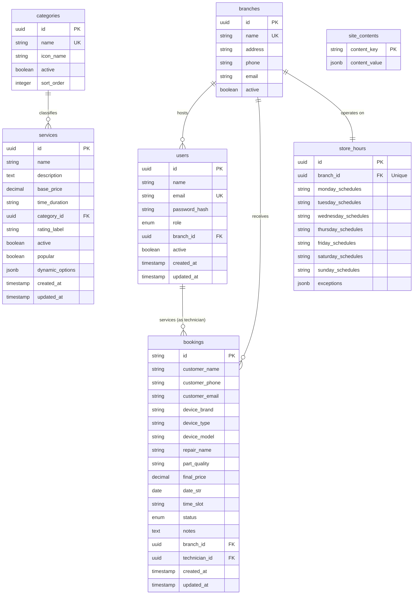

# MPC Repairs - Database Schema & Entity Relationship Diagram

This document defines the relational database architecture, field types, validation constraints, indices, and data relationships for the MPC Repairs platform.

---

## 🗺️ Entity Relationship Diagram (ERD)



---

## 🗄️ Detailed Model Definitions

### 1. `users` Table
Stores login credentials and roles for administrative and technical personnel.

| Column | Data Type | Constraints | Default | Description |
| :--- | :--- | :--- | :--- | :--- |
| `id` | UUID | Primary Key, Not Null | `gen_random_uuid()` | Unique user identifier |
| `name` | VARCHAR(255) | Not Null | None | User's full name |
| `email` | VARCHAR(255) | Unique, Not Null | None | Login email credential |
| `password_hash` | VARCHAR(255) | Not Null | None | Password hashed with bcrypt |
| `role` | VARCHAR(50) | Not Null | `'Technician'` | Access level: `'SuperAdmin'`, `'BranchManager'`, `'Technician'` |
| `branch_id` | UUID | Foreign Key, Nullable | Null | References `branches(id)`. Null means global access. |
| `active` | BOOLEAN | Not Null | `true` | Enables or suspends user authorization |
| `created_at` | TIMESTAMP | Not Null | `CURRENT_TIMESTAMP` | Date of account creation |
| `updated_at` | TIMESTAMP | Not Null | `CURRENT_TIMESTAMP` | Last profile modifications date |

---

### 2. `bookings` Table
Holds detailed transaction profiles for scheduled hardware repairs.

| Column | Data Type | Constraints | Default | Description |
| :--- | :--- | :--- | :--- | :--- |
| `id` | VARCHAR(50) | Primary Key, Not Null | None | Formatted ID (e.g. `'BKG-5092'`) |
| `customer_name` | VARCHAR(255) | Not Null | None | Full name of the customer |
| `customer_phone` | VARCHAR(50) | Not Null | None | Contact mobile number |
| `customer_email` | VARCHAR(255) | Not Null | None | Contact email address |
| `device_brand` | VARCHAR(100) | Not Null | None | Manufacturer (e.g., `'Apple'`, `'Samsung'`) |
| `device_type` | VARCHAR(100) | Not Null | None | Device grouping (e.g., `'Phone'`, `'Laptop'`) |
| `device_model` | VARCHAR(255) | Not Null | None | Specific model title (e.g., `'iPhone 16 Pro'`) |
| `repair_name` | VARCHAR(255) | Not Null | None | Repair category title (e.g., `'Screen Repair'`) |
| `part_quality` | VARCHAR(255) | Nullable | Null | Selected parts grade tier (e.g., `'Genuine OLED'`) |
| `final_price` | NUMERIC(10, 2) | Not Null | None | Final check-out pricing amount |
| `date_str` | DATE | Not Null | None | Appointment date (YYYY-MM-DD) |
| `time_slot` | VARCHAR(20) | Not Null | None | Booking hour string (e.g., `'10:30 AM'`) |
| `status` | VARCHAR(50) | Not Null | `'Pending'` | Status: `'Pending'`, `'Confirmed'`, `'In Progress'`, `'Completed'`, `'Cancelled'`, `'Rejected'` |
| `notes` | TEXT | Nullable | Null | Diagnostic notes / user requests |
| `branch_id` | UUID | Foreign Key, Not Null | None | References `branches(id)` |
| `technician_id` | UUID | Foreign Key, Nullable | Null | References `users(id)` (Technician profile) |
| `created_at` | TIMESTAMP | Not Null | `CURRENT_TIMESTAMP` | Time booking record was initialized |
| `updated_at` | TIMESTAMP | Not Null | `CURRENT_TIMESTAMP` | Last state update timestamp |

---

### 3. `services` Table
Stores catalogs of repairs, baseline pricing guides, and dynamic options.

| Column | Data Type | Constraints | Default | Description |
| :--- | :--- | :--- | :--- | :--- |
| `id` | UUID | Primary Key, Not Null | `gen_random_uuid()` | Unique ID |
| `name` | VARCHAR(255) | Not Null | None | Service name |
| `description` | TEXT | Not Null | None | Service details copy |
| `base_price` | NUMERIC(10, 2) | Not Null | None | Minimum starting cost |
| `time_duration` | VARCHAR(50) | Not Null | `'60 min'` | Average completion time |
| `category_id` | UUID | Foreign Key, Not Null | None | References `categories(id)` |
| `rating_label` | VARCHAR(100) | Nullable | Null | Grade label (e.g. `'OLED Premium'`) |
| `active` | BOOLEAN | Not Null | `true` | Shows or hides service from public catalogs |
| `popular` | BOOLEAN | Not Null | `false` | Enables "Popular" banner tag in UI lists |
| `dynamic_options`| JSONB | Nullable | Null | Array of custom part variables: `[{id, name, price, description}]` |
| `created_at` | TIMESTAMP | Not Null | `CURRENT_TIMESTAMP` | Time of creation |
| `updated_at` | TIMESTAMP | Not Null | `CURRENT_TIMESTAMP` | Time of modification |

---

### 4. `categories` Table
Categories displayed in selectors.

| Column | Data Type | Constraints | Default | Description |
| :--- | :--- | :--- | :--- | :--- |
| `id` | UUID | Primary Key, Not Null | `gen_random_uuid()` | Unique ID |
| `name` | VARCHAR(100) | Unique, Not Null | None | Category name (e.g. `'Smartphones'`) |
| `icon_name` | VARCHAR(100) | Not Null | `'Smartphone'` | Lucide React icon string |
| `active` | BOOLEAN | Not Null | `true` | Toggle configuration active status |
| `sort_order` | INTEGER | Unique, Not Null | None | Layout ordering rank index |

---

### 5. `branches` Table
Physical retail store locations.

| Column | Data Type | Constraints | Default | Description |
| :--- | :--- | :--- | :--- | :--- |
| `id` | UUID | Primary Key, Not Null | `gen_random_uuid()` | Unique ID |
| `name` | VARCHAR(255) | Unique, Not Null | None | Location title (e.g. `'Westfield Expert Kotara'`) |
| `address` | VARCHAR(500) | Not Null | None | Physical storefront address |
| `phone` | VARCHAR(50) | Not Null | None | Direct branch phone |
| `email` | VARCHAR(255) | Not Null | None | Direct branch contact inbox |
| `active` | BOOLEAN | Not Null | `true` | Enable/disable store branch |

---

### 6. `store_hours` Table
Weekly operating hours and scheduling exceptions (such as holidays).

| Column | Data Type | Constraints | Default | Description |
| :--- | :--- | :--- | :--- | :--- |
| `id` | UUID | Primary Key, Not Null | `gen_random_uuid()` | Unique ID |
| `branch_id` | UUID | Unique Foreign Key, Not Null | None | References `branches(id)` |
| `monday_schedules` | VARCHAR(100) | Not Null | `'09:00 AM - 05:30 PM'` | Operating hours range for Monday |
| `tuesday_schedules` | VARCHAR(100) | Not Null | `'09:00 AM - 05:30 PM'` | Operating hours range for Tuesday |
| `wednesday_schedules`| VARCHAR(100)| Not Null | `'09:00 AM - 05:30 PM'` | Operating hours range for Wednesday |
| `thursday_schedules`| VARCHAR(100) | Not Null | `'09:00 AM - 09:00 PM'` | Late-night hours trade for Thursday |
| `friday_schedules` | VARCHAR(100) | Not Null | `'09:00 AM - 05:30 PM'` | Operating hours range for Friday |
| `saturday_schedules`| VARCHAR(100) | Not Null | `'09:00 AM - 05:00 PM'` | Operating hours range for Saturday |
| `sunday_schedules` | VARCHAR(100) | Not Null | `'Closed'` | Operating hours range for Sunday |
| `exceptions` | JSONB | Not Null | `'[]'`::jsonb | Array of holiday overrides: `[{date: "YYYY-MM-DD", is_closed: true, custom_hours: "10am-2pm"}]` |

---

### 7. `site_contents` Table
System variables, slideshow carousels, and landing layouts managed by administrators.

| Column | Data Type | Constraints | Default | Description |
| :--- | :--- | :--- | :--- | :--- |
| `content_key` | VARCHAR(255) | Primary Key, Not Null | None | Key name (e.g. `'homepage_sliders'`) |
| `content_value` | JSONB | Not Null | None | JSON block holding images, text strings, and layout keys |

---

## 🔑 Database Keys, Indexes & Optimization Parameters

### 1. Index Structures
To ensure high performance for client filtering and search:

*   **Fuzzy Search Index (PostgreSQL GIN / Trigram Index)**:
    Applied on `bookings(device_model)`, `bookings(customer_name)`, and `bookings(customer_phone)` to accelerate searching in the bookings directory:
    ```sql
    CREATE EXTENSION IF NOT EXISTS pg_trgm;
    CREATE INDEX idx_bookings_search_gin ON bookings USING gin (customer_name gin_trgm_ops, device_model gin_trgm_ops);
    ```
*   **Composite Index on Scheduling lookups**:
    Applied on the most queried columns during booking creation and calendar rendering:
    ```sql
    CREATE INDEX idx_bookings_schedule ON bookings (branch_id, date_str, time_slot);
    ```
*   **Foreign Key Indexing**:
    All foreign keys indexed to optimize relation joins:
    ```sql
    CREATE INDEX idx_bookings_technician ON bookings (technician_id);
    CREATE INDEX idx_store_hours_branch ON store_hours (branch_id);
    CREATE INDEX idx_services_category ON services (category_id);
    ```

### 2. Referential Integrity & Constraints
*   **Cascade Restrictions on Branch Deletions**:
    If a branch location is deleted (`branches`), all associated users and bookings must be updated. We prevent deletion if there are active bookings:
    `ON DELETE RESTRICT`
*   **Technician Deletion**:
    If a technician user is deleted, associated bookings are unassigned:
    `ON DELETE SET NULL`
