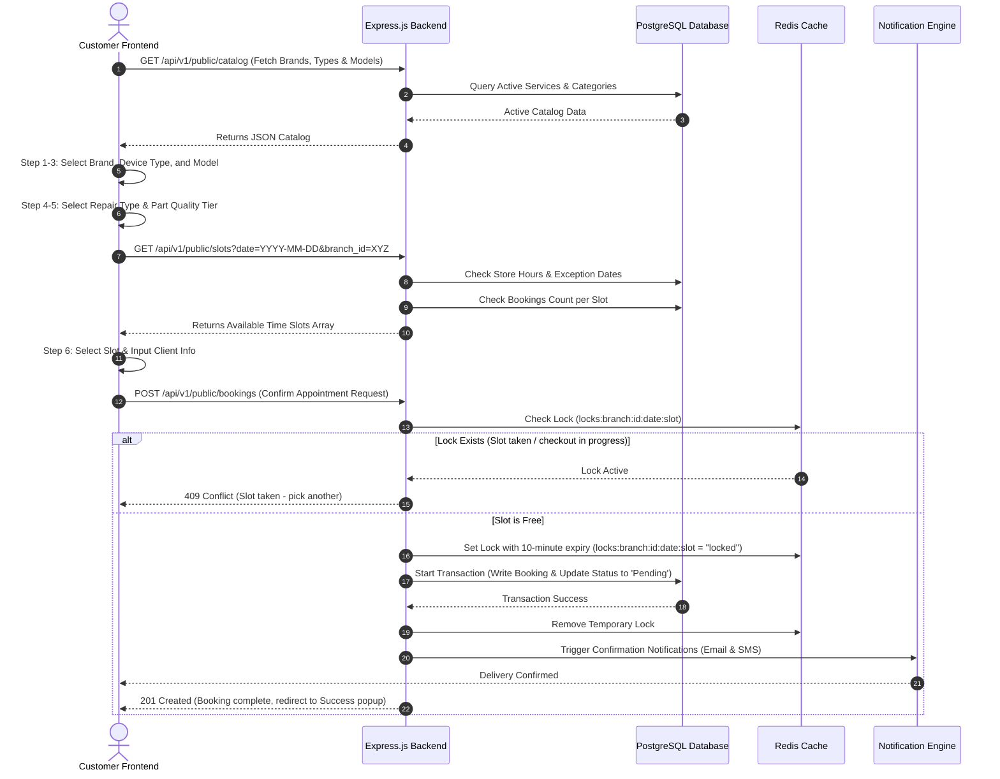
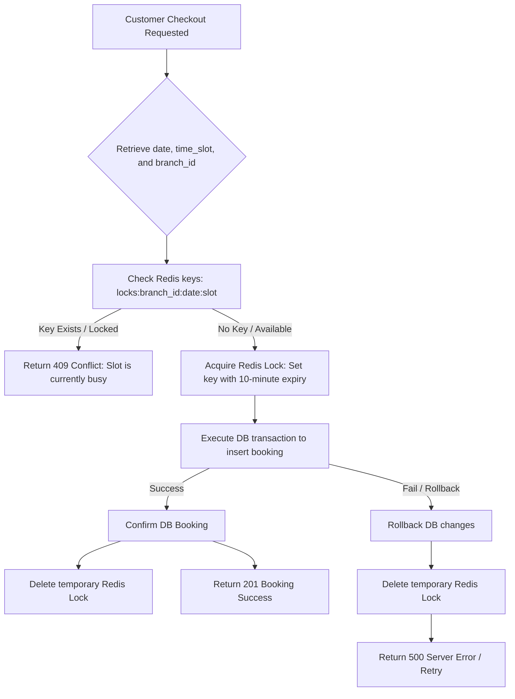
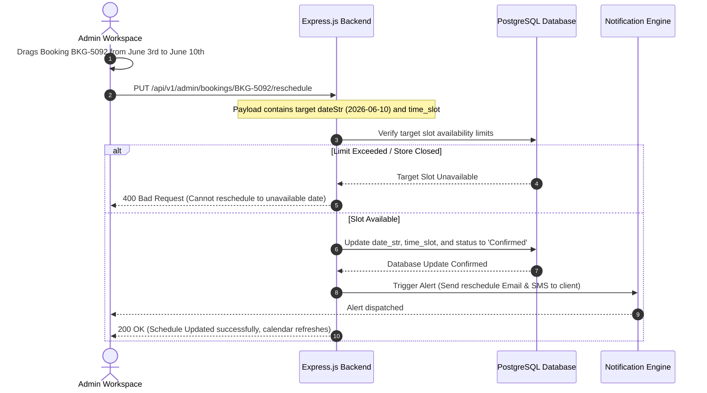

# MPC Repairs - Operational Workflows & System Flows

This document details the operational flows, state transitions, and business logics within the MPC Repairs booking and management system.

---

## 📅 1. Customer Booking & Checkout Flow
Shows the progression from a client visiting the site to scheduling a confirmed repair slot.



---

## 🔒 2. Double-Booking Prevention Logic Flow
Ensures that multiple checkouts do not result in overbooking the same time slot at the same store branch.



---

## 🕰️ 3. Store Hours & Holiday Exceptions Validator Flow
Computes available time slots for the customer scheduling calendar.

```mermaid
flowchart TD
    A[Request Available Slots for Date & Branch] --> B[Fetch Branch Schedules & Exceptions]
    B --> C{Is Date listed in Exception Holidays?}
    C -->|Yes, is_closed = true| D[Return slots: [] - Branch Closed on this day]
    C -->|Yes, has custom_hours| E[Set schedule limits to holiday trade hours]
    C -->|No| F[Fetch regular hours matching day of week]
    F --> G{Is Schedule status 'Closed'?}
    G -->|Yes (e.g. Sunday)| H[Return slots: [] - Closed on Sundays]
    G -->|No (Open)| I[Split operating range into 90-minute slot intervals]
    E --> I
    I --> J[Fetch count of active bookings for date & slot]
    J --> K{Bookings Count >= Max Limit per slot?}
    K -->|Yes| L[Remove slot from available list]
    K -->|No| M[Retain slot in available list]
    L & M --> N[Return final list of available slots to Frontend]
```

---

## 🎛️ 4. Admin Calendar Rescheduling (Drag & Drop Flow)
How calendar edits update scheduling states in real time.



---

## 📧 5. Status Transitions & Notification Workflows
Standard lifecycle transitions of a booking and triggered notifications.

```mermaid
stateDiagram-v2
    [*] --> Pending : Customer places booking online
    
    state Pending {
        [*] --> SendManagerAlert : Emails store manager of new queue
        SendManagerAlert --> SendCustomerReceipt : Emails & SMS client receipt verification
    }
    
    Pending --> Confirmed : Admin reviews and schedules
    Confirmed --> SendMapDetails : SMS Twilio + SendGrid dispatch (Includes branch details & map pin)
    
    Confirmed --> InProgress : Technician checks-in device
    InProgress --> TechnicianNotification : Emails technician assigned details (Alex, Sarah, James)
    
    InProgress --> Completed : Repair completed & quality checked
    state Completed {
        [*] --> GenerateInvoice : Generates PDF invoice & uploads to Cloud S3
        GenerateInvoice --> SendInvoiceEmail : Emails PDF invoice copy to customer
        SendInvoiceEmail --> SendReviewRequest : Sends review request link (Mock Google Review)
    }
    
    Pending --> Rejected : Admin rejects schedule (Incompatible part/slot)
    Rejected --> SendCancellationNotification : Sends rejection explanation email
    
    Confirmed --> Cancelled : Customer requests cancellation
    Cancelled --> SendCancellationNotification : Sends confirmation of cancellation
    
    Completed --> [*]
    Rejected --> [*]
    Cancelled --> [*]
