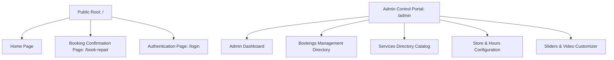

# MPC Repairs - Complete Wireframe & Functional Specification (A to Z)

This document provides a comprehensive A to Z wireframe and functional specification for the MPC Repairs device repair booking system and administration management portal.

---

## 🛠️ Technology Stack & Project Architecture

The application is built on a modern, lightweight, and reactive frontend architecture:
1.  **Core Framework**: HTML5, CSS3, JavaScript (React.js compiled via Vite)
2.  **Styling**: Tailwind CSS + Custom CSS styling overrides (`index.css`, `App.css`)
3.  **Animations**: Framer Motion (used for fluid modal transitions, slide-ins, and success popups)
4.  **Icon Library**: Lucide React (for uniform vector icons)
5.  **State Management**: React Context API (`BookingContext.jsx` with persistent browser LocalStorage synchronizer)
6.  **Data Compilation Engine**: Node.js/CommonJS database script (`generateRepairDatabase.cjs`)

---

## 📂 Site Map & Routing Layout

The system is split into two primary routing sections: the **Public Booking Interface** and the **Secure Admin Control Panel**.



### 🛣️ Application Routes (App.jsx)
*   **Public Layout (`/`)**
    *   `index` ➡️ [Home Page](file:///d:/KIAAN/mobile-repair/mobile-repair/frontend/src/pages/Home.jsx) (Services catalog index & categories list)
    *   `/book-repair` ➡️ [Repair Booking Confirm](file:///d:/KIAAN/mobile-repair/mobile-repair/frontend/src/pages/RepairBooking.jsx) (Appointment scheduler form)
*   **Authentication**
    *   `/login` ➡️ [Admin Login Page](file:///d:/KIAAN/mobile-repair/mobile-repair/frontend/src/pages/Login.jsx) (Secure portal login)
*   **Admin Layout (`/admin`)**
    *   `/admin` ➡️ [Admin Dashboard](file:///d:/KIAAN/mobile-repair/mobile-repair/frontend/src/pages/AdminDashboard.jsx) (Master interactive calendar view)
    *   `/admin/bookings` ➡️ [Bookings Table](file:///d:/KIAAN/mobile-repair/mobile-repair/frontend/src/pages/AdminBookings.jsx) (CRUD list & booking status manager)
    *   `/admin/calendar` ➡️ [Admin Calendar View](file:///d:/KIAAN/mobile-repair/mobile-repair/frontend/src/pages/AdminCalendar.jsx) (Detailed scheduling grids)
    *   `/admin/services` ➡️ [Services Catalog](file:///d:/KIAAN/mobile-repair/mobile-repair/frontend/src/pages/AdminServices.jsx) (Catalog prices editor)
    *   `/admin/store` ➡️ [Branches Manager](file:///d:/KIAAN/mobile-repair/mobile-repair/frontend/src/pages/AdminStore.jsx) (Branch directories configuration)
    *   `/admin/hours` ➡️ [Hours Settings](file:///d:/KIAAN/mobile-repair/mobile-repair/frontend/src/pages/AdminHours.jsx) (Working hours & scheduling exceptions)
    *   `/admin/sliders` ➡️ [Sliders Manager](file:///d:/KIAAN/mobile-repair/mobile-repair/frontend/src/pages/AdminSliders.jsx) (Carousel slide items customizer)
    *   `/admin/video` ➡️ [Video Control](file:///d:/KIAAN/mobile-repair/mobile-repair/frontend/src/pages/AdminVideo.jsx) (Explainer video player customizer)
    *   `/admin/settings` ➡️ [Site Settings](file:///d:/KIAAN/mobile-repair/mobile-repair/frontend/src/pages/AdminSettings.jsx) (Store details & styling presets)

---

## 🖥️ Public Website Wireframe (Layout Specification)

### 1. Global Header & Navigation Bar
Rendered at the top of all public pages:
```
+---------------------------------------------------------------------------------+
|  [Logo] MPC Repairs          Home   Services   Reviews   Explainer   [Book Now] |
+---------------------------------------------------------------------------------+
```
*   **Logo**: SVG brand identity component (`Logo.jsx`).
*   **Anchors**: Smooth scroll bookmarks linked to `#services`, `#reviews`, `#explainer`, and `#process`.
*   **CTA Button [Book Now]**: Opens the interactive 5-Step Booking Modal overlay instantly.

---

### 2. Homepage Layout (`/`)

#### A. Hero Banner Section
Visual header designed with soft glowing background blobs.
```
+---------------------------------------------------------------------------------+
|  ● Accepting new repairs today                                                  |
|                                                     +------------------------+  |
|  Premium Repair.                                    | [Image: Unsplash 3D]   |  |
|  Zero Compromise.                                   |                        |  |
|                                                     | [Lifetime Warranty]    |  |
|  Experience world-class device repair with...       | [Under 2 Hrs Repair]   |  |
|                                                     +------------------------+  |
|  [Start Repair]   [Track Order]                                                 |
|                                                                                 |
|  ⭐⭐⭐⭐⭐ 4.9/5 from 10k+ verified reviews                                    |
+---------------------------------------------------------------------------------+
```
*   **Accepting Status Badge**: Displays a pulsating green status dot indicating store operations are online.
*   **Start Repair Button**: Activates the Step-by-Step Booking Modal wizard.
*   **Track Order Button**: Triggers a tracking lookup overlay (Alert placeholder indicates feature release coming soon).
*   **Floating badges**: Interactive tilt cards demonstrating `Lifetime Warranty` and `Under 2 Hrs Fast Turnaround`.

#### B. Interactive Device Categories Selector
Allows customers to preview repair stats and features by category.
```
+---------------------------------------------------------------------------------+
|  What can we fix for you?                                                       |
|                                                                                 |
|  +---------------------------+   +-------------------------------------------+  |
|  | [Icon] Smartphones      > |   |   🔋 4.2k+ Repairs   [Smartphones]        |  |
|  | [Icon] Laptops          > |   |   From cracked screens to battery...      |  |
|  | [Icon] Tablets & iPads  > |   |   - Genuine OEM Parts                     |  |
|  | [Icon] Wearables        > |   |   - Same-day Service                      |  |
|  +---------------------------+   |   [Start Smartphones Repair]              |  |
|                                  +-------------------------------------------+  |
+---------------------------------------------------------------------------------+
```
*   **Left Column Category Tabs**: Clicking tabs transitions the visual styles of active categories.
*   **Right Display Panel**: Dynamically renders repair totals (e.g. 4.2k+ Repairs), a custom category text, feature checklists, and a booking link.

#### C. Specialized Services Grid
Highlights the main repair categories offered at the shop:
```
+---------------------------------------------------------------------------------+
|                              Specialized Services                               |
|                                                                                 |
|  +------------------+  +------------------+  +------------------+  +---------+  |
|  | [Screen Replace] |  | [Battery Swap]   |  | [Water Damage]   |  | [Logic  |  |
|  | Original OLED... |  | 100% Health...   |  | Ultrasonic...    |  | Level 3 |  |
|  +------------------+  +------------------+  +------------------+  +---------+  |
+---------------------------------------------------------------------------------+
```

#### D. Explainer Video Showroom Section
Custom video player component detailing the repair process.
```
+---------------------------------------------------------------------------------+
|                               See Us in Action                                  |
|                                                                                 |
|  +---------------------------------------------------------------------------+  |
|  |                                [VIDEO PLAYING]                            |  |
|  |                                                                           |  |
|  | (>) Play/Pause   0:11 |======-----------------------| 0:33  (Vol) [Full]  |  |
|  +---------------------------------------------------------------------------+  |
+---------------------------------------------------------------------------------+
```
*   **Loop Playback**: Sequentially cycles across 3 high-quality repair clips.
*   **Custom Control Overlay**: Fades in on hover. Features play/pause toggle, interactive progress seeker, audio mute/unmute control, and fullscreen command.

#### E. Service Process Steps
Step-by-step repair walkthrough:
```
+---------------------------------------------------------------------------------+
|  01. Book Online  ===>  02. Free Diagnostic  ===>  03. Expert Repair  ===>  04. Return |
+---------------------------------------------------------------------------------+
```

#### G. Customer Reviews Testimonial Carousel
Draws mock review stars and Google profiles:
*   **Global Google Rating Badge**: Displays aggregate rating score (4.9 stars) across 10,000+ reviews.
*   **Verified Review Cards**: Cards displaying client profile avatars, star ratings, customized review feedback copy, and date metadata.

---

### 3. Interactive Booking Modal (5-Step Wizard Overlay)
The core component managing brand, device, model, and repair selections.

```
+---------------------------------------------------------------------------+
| [<- Back]                     Step X of Y                      [Close (X)]|
|                        (Progress Indicator Line)                          |
+---------------------------------------------------------------------------+
|                                                                           |
|                               (Step Content)                              |
|                                                                           |
+---------------------------------------------------------------------------+
```

*   **Step 1: Select Brand**
    *   A grid of brand buttons generated from the keys of the compiled database (e.g. Apple, Samsung, Google, Dell, etc.).
*   **Step 2: Select Device Type**
    *   Lists the sub-categories available under the chosen brand (e.g., Phone, Tablet, Laptop, Watch, Earbuds).
*   **Step 3: Select Model**
    *   **Live Search Input**: Features dynamic filtering logic. Displays a list of devices matching the query with release years.
*   **Step 4: Select Repair Option**
    *   Renders a grid of diagnostic and repair cards (Popular highlights, repair durations, warranties, and pricing tags).
    *   *If the selection does not require quality configuration, the modal automatically redirects the client to the `/book-repair` page.*
*   **Step 5: Choose Quality Level (Dynamic Parts Configurator)**
    *   Triggered for screen replacements and back glass repairs on supported models (e.g., iPhones):
        1. **Aftermarket In-Cell LCD**: Budget-friendly display panel option.
        2. **Aftermarket Soft OLED**: Matching factory contrast and bezels (Highly recommended).
        3. **Genuine Apple OLED**: Premium original quality assembly.
    *   Selecting the quality tier routes the user to the `/book-repair` confirmation form.

---

### 4. Appointment Booking Confirmation Page (`/book-repair`)
Processes the scheduling slot and stores user records.

```
+---------------------------------------------------------------------------------+
| [<- Back to Selection]                                                          |
| iPhone 16 Pro Max - Screen Repair                                               |
|                                                                                 |
| +-------------------------------------+   +----------------------------------+  |
| | **Repair Details & Price**          |   | **Book Your Appointment**        |  |
| | Price: A$369.00 (Soft OLED)         |   |                                  |  |
| | Duration: 1 Hour                    |   | Name: [________________________] |  |
| | Warranty: 12 Months                 |   | Phone: [_______________________] |  |
| |                                     |   | Email: [_______________________] |  |
| | **What's Included:**                |   |                                  |  |
| | [Check] Premium Parts               |   | Location: (o) Kotara Westfield   |  |
| | [Check] 1-Hour Repair               |   |                                  |  |
| | [Check] Free Diagnostic             |   | **Date:** [ June 2026 Calendar ] |  |
| |                                     |   | **Time:** [9:00 AM] [10:30 AM].. |  |
| | [ Why Choose MPC Repairs Badges ]   |   | Notes: [_______________________] |  |
| |                                     |   |                                  |  |
| |                                     |   | [ Confirm Appointment - A$369.00]|  |
| +-------------------------------------+   +----------------------------------+  |
+---------------------------------------------------------------------------------+
```

*   **Left Column (Order Summary)**: Contains active device configuration, parts grade summary, final price, duration, warranty parameters, and inclusion benefits.
*   **Right Column (Appointment Forms)**:
    *   **Customer Fields**: Full Name, Phone, and Email address inputs (required).
    *   **Location Selection**: Radio list containing shop branch names (e.g. Westfield Expert Kotara).
    *   **Interactive Calendar Widget**: Calendar grid displaying dates in the active booking month (June 2026). Selected dates are highlighted.
    *   **Time Slots Selector**: Visual buttons mapping to available appointment times.
    *   **Notes Fields**: Message input box for diagnostics notes.
*   **Success Dialog Overlay**: Activated upon booking. Outlines booking details (Device, Time slot, Reference ID) and handles redirect transitions.

---

## 🔐 Admin Dashboard Wireframe (Control Portal)

Administrators can login via `/login` to view booking logs and configure operations.

### 1. Main Admin Layout
```
+---------------------------------------------------------------------------------+
| [Sidebar Toggle]   Store: [Kotara Westfield  v]             [Admin User Profile]|
+---------------------------------------------------------------------------------+
| (Sidebar)        |                                                              |
| [Icon] Dashboard |                  (Main Admin Workspace Page)                 |
| [Icon] Bookings  |                                                              |
| [Icon] Calendar  |                                                              |
| [Icon] Services  |                                                              |
| [Icon] Stores    |                                                              |
| [Icon] Settings  |                                                              |
+------------------+--------------------------------------------------------------+
```

### 2. Admin Dashboard Workspace (`/admin`)

#### A. Diagnostic Metrics Cards
Renders 4 widgets tracking database activities:
1.  **New Booking Count** (Amber theme): Unprocessed pending customer appointments.
2.  **Total Booking Count** (Emerald theme): Total appointment logs.
3.  **New Enquiry Count** (Yellow theme): Tracked contact form entries.
4.  **Quick Settings Shortcut** (Purple theme): Portal settings router.

#### B. Master Booking Scheduler (Calendar Control Component)
Renders a master planning schedule:
```
+---------------------------------------------------------------------------------+
|  [ < ]  today  [ > ]     [+ Add Booking]     June 2026   [Month] [Week] [Day] [List] |
+---------------------------------------------------------------------------------+
|  Sun    |  Mon    |  Tue    |  Wed    |  Thu    |  Fri    |  Sat    |
+---------+---------+---------+---------+---------+---------+---------+
|         | 1       | 2       | 3       | 4       | 5       | 6       |
|         |         |         | [Alice] | [David] |         |         |
|         |         |         | [Clare] |         |         |         |
+---------+---------+---------+---------+---------+---------+---------+
| 7       | 8       | 9       | 10      | 11      | 12      | 13      |
| [Jayde] | [Dean]  |         | [Igor]  |         | [Emma]  |         |
+---------+---------+---------+---------+---------+---------+---------+
```

*   **Calendar View Toggles**:
    *   *Month View*: Comprehensive monthly calendar grid.
    *   *Week View*: Displays a weekly agenda view divided into daily columns with specific hourly slots.
    *   *Day View*: Renders an hourly timeline mapping appointments for the selected day.
    *   *List View*: Tabular view sorting client bookings. Includes actions to change statuses (`Pending`, `Mark Complete`, `Reject`).
*   **Drag-and-Drop Handler**: Admins can grab a booking card, drag it to another date cell, and release it. This updates the appointment's date field in `BookingContext` dynamically.
*   **Quick Add Booking Form**: Modal overlay allowing admins to schedule walk-ins manually.
*   **Booking Detail Overlay**: Clicking any event reveals customer contact information (Name, Phone, Email, custom diagnostic notes) and repair specifics.

---

### 3. Services Directory Panel (`/admin/services`)
Administrative interface for price grids and category tags.
```
+---------------------------------------------------------------------------------+
|  Services Directory   [+ Add New Service]                                        |
|                                                                                 |
|  Filters: [All]  [Phones]  [Laptops]  [Tablets]           Search: [___________] |
|                                                                                 |
|  +---------------------------------------------------------------------------+  |
|  | iPhone Screen Replacement  [Category: Phone]  Status: (x) Active          |  |
|  | Price: $149     Duration: 60 min      [Edit Icon]  [Delete Icon]          |  |
|  +---------------------------------------------------------------------------+  |
|  | MacBook Battery Service   [Category: Laptop] Status: ( ) Inactive        |  |
|  | Price: $199     Duration: 90 min      [Edit Icon]  [Delete Icon]          |  |
|  +---------------------------------------------------------------------------+  |
+---------------------------------------------------------------------------------+
```
*   **Add/Edit Service Form**: Form fields for editing repair titles, pricing, durations, quality parameters, parent categories, and descriptions.
*   **Service Toggle Switch**: Enables/disables specific catalog items from appearing on the public page.
*   **Categories Sub-Page**: Section to add or configure device categories (e.g. Phones, Laptops, Wearables).

---

## ⚙️ Backend Logic & Core Software Functions

Detailed specifications of logic processes in the application:

### 1. Unified Database Compiler (`generateRepairDatabase.cjs`)
A Node.js processing script that builds the master JSON pricing database from raw text files.
*   **Brand Weights Hierarchy**: Hardcoded hierarchy matrix maps pricing weights (Apple/Microsoft = 1.0, Samsung/Google = 0.8, HP/Dell = 0.3).
*   **Fuzzy Header Normalization**: Matches line titles from text dumps using `getCleanName` to clean formatting, matching them against known models in the `modelsDB` object.
*   **Dynamic Price Calculation Engine**:
    *   If a specific repair price is missing in the raw logs, `getBounds` retrieves the repair type bounds.
    *   The engine calculates a fallback price based on brand weight and release year:
        $$\text{Price} = \text{MinPrice} + (\text{CombinedScore} \times (\text{MaxPrice} - \text{MinPrice})) + \text{Jitter}$$
    *   **Price Snapping**: Rounds pricing values to end in `9` (e.g. $169, $229) to match standard retail templates.
*   **Master Export**: Saves structured data objects into `frontend/src/data/repairDatabase.json`.

### 2. State & Persistence Controller (`BookingContext.jsx`)
Global state management wrapper:
*   **Default Seed Bookings**: Pre-populates the database with 34 mock bookings (BKG-5092 to BKG-5098, BKG-0001 to BKG-0027) so the calendar demonstrates realistic scheduler lists.
*   **Modal State Variables**: Tracks step numbers (1 to 5), selected brands, device categories, models, and selected quality options.
*   **State Actions**:
    *   `addBooking(newBooking)`: Builds a new booking record with a random ID (BKG-XXXX).
    *   `updateBooking(id, updatedFields)`: Modifies booking items (e.g. rescheduled dates).
    *   `deleteBooking(id)`: Removes appointments.
*   **LocalStorage Persistence**: Stores user-created bookings inside `irepair_global_bookings` to persist user data across HMR updates and browser restarts.

### 3. Scroll Prevention Mechanism (`BookingModal.jsx`)
Prevents underlying page scrolling when the booking modal wizard is open:
*   Sets body style to `document.body.style.overflow = 'hidden'` on mount/open.
*   Resets style to `document.body.style.overflow = 'unset'` on unmount/close.

---

## 🎨 Premium Theme & Styling Tokens

Consistent design system configurations used in stylesheets:
*   **Primary Dark Slate**: `#0F172A` (borders, dark backgrounds, high-contrast headings)
*   **Primary Highlight Yellow**: `#FFDE21` (buttons, active tabs, calendar highlights)
*   **Clean Light Background**: `#F8FAFC` (soft content background panels)
*   **Success Green**: `#22C55E` (confirmed labels, active indicator dots)
*   **Typography**: Google Fonts Inter / Outfit (Modern sans-serif typography)
*   **Visual Filters**: Glassmorphism overlays (`backdrop-blur-md` and soft layout shadows)

---
**MPC Repairs - Complete Wireframe & Functional Specification Document** - Version 1.0 (June 2026). All systems fully documented in English.
